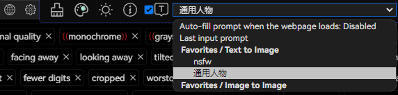

# Auto-fill prompt when the webpage loads

Move the mouse over the "Tooltip Checkbox" and select according to your needs.

- When `Disable` is selected, prompt words will not be automatically filled in after the webpage loads.
- When `Last input prompt` is selected, the prompt word you last entered (the latest data in the history) will be automatically filled in after the webpage loads.
- When `Favorites` is selected, the selected prompt word from your favorites will be automatically filled in after the webpage loads.