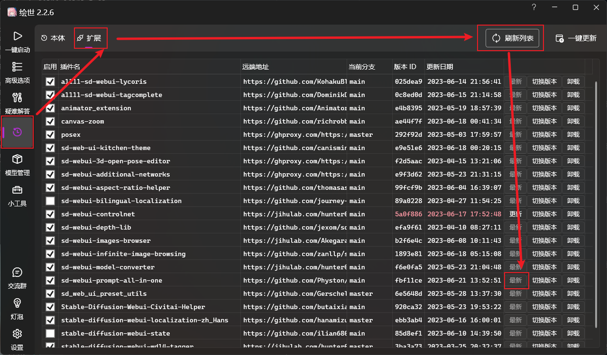

# Extension update description

1. All your data, including API keys, history records, and favorite data, are stored in the `storage` directory of the extension.

2. Using the built-in updater in WebUI or updating via git will not cause your data to be lost.

3. Overwriting the extension installation with a compressed file or deleting the extension and reinstalling it will result in data loss.

4. If you want to backup your data, you can copy the `storage` directory to another location and then copy it back when needed.

## Update Methods

### Method 1 (Updating with git):

> This method requires Git to be installed on your computer. If it is not installed, please refer to the official [Git documentation](https://git-scm.com/book/en/v2/Getting-Started-Installing-Git) for installation instructions.

1. Open the terminal and navigate to your extension directory.

    ```shell
    cd path to your WebUI/extensions/sd-webui-prompt-all-in-one
    ```

2. Update using git.

    ```shell
    git pull
    ```

   

3. Restart the Stable Diffusion WebUI.

### Method 2 (Updating within the WebUI):

1. Open the WebUI webpage.

2. Click on `Extensions` - `Installed` - `Check for Updates`.

3. Click on `Apply and Restart UI`.

   

### Method 3 (Updating within the Qiuye Launcher):

> If you are using the Qiuye Launcher, you can update the extension within the launcher.

1. Open the Qiuye Launcher.

2. Click on `Version Management` - `Extensions` - `Refresh List`.

3. Click on the `Update` button next to `sd-webui-prompt-all-in-one`.

   

4. Restart the Stable Diffusion WebUI.