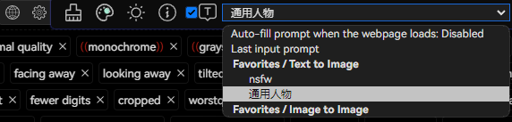

# Автоматическое заполнение при загрузке веб-страницы

Наведите указатель мыши на "Флажок подсказки" и выберите в соответствии с вашими потребностями.

- При выборе `Отключено` подсказки не будут автоматически заполняться после загрузки веб-страницы.
- При выборе `Последний запрос на ввод` после загрузки веб-страницы будет автоматически заполняться последнее введенное вами слово (последние данные из истории).
- При выборе `Избранное` после загрузки веб-страницы будет автоматически заполняться выбранное вами слово из избранного.