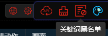
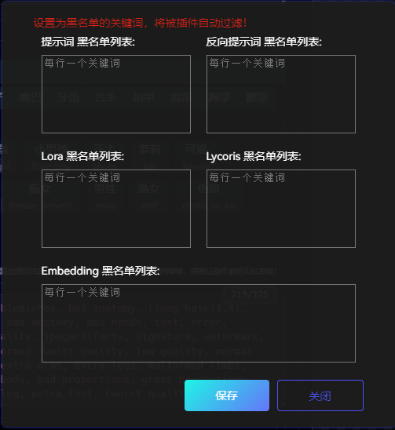

# Черный список подсказок

1. Наведите указатель мыши на иконку `кнопки настроек`.

   

2. Щелкните на иконке `черного списка подсказок`.

   

3. Установите подсказки, которые нужно отфильтровать, в соответствии с вашими потребностями.