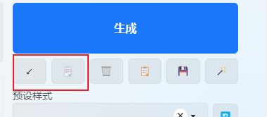

# :star: 常见问题

### Q: 无需api key的翻译接口和需要api key的翻译接口有什么区别？

> 无需api key的翻译接口，是通过爬虫获取的，不需要用户自己申请api key，但是可能会存在翻译失败的情况，稳定下差，速度慢，不支持并发。需要api key的翻译接口，是通过调用第三方翻译服务的api接口，需要用户自己申请api key，但是翻译成功率较高，某些接口支持高并发，翻译速度快。
> 
> 详情请见：[翻译接口说明](/zh-CN/TranslationApiConfiguration.md#翻译接口说明)

### Q: 无法使用翻译服务，点击“测试”，提示“No module named 'xxx'”？

> 这是由于webui启动时，没有正确的安装依赖导致的，可以通过以下方式解决：
> 1. 切换到webui所使用的python/bin目录。
> 2. 执行命令：
>    ```
>    ./python -m pip install chardet
>    ./python -m pip install fastapi
>    ./python -m pip install PyExecJS
>    ./python -m pip install lxml
>    ./python -m pip install tqdm
>    ./python -m pip install pathos
>    ./python -m pip install cryptography
>    ./python -m pip install openai
>    ./python -m pip install boto3
>    ./python -m pip install aliyun-python-sdk-core
>    ./python -m pip install aliyun-python-sdk-alimt
>    ```
> 3. 等待安装完成后，重启webui。
>
> 详情请见：[安装套件](/zh-CN/InstallationPackages.md)

### Q: 显示错误消息："连接到后台接口服务失败，请手动再刷新一次网页。如果还是不行，请重启WebUI"。

> - 你可能需要刷新网页或者重启WebUI。
> - 这是由于WebUI启动时，没有正确的安装依赖，参考上方安装模块的方法。
> - 进入`extensions\sd-webui-prompt-all-in-one\storage`目录，将`history.*.json`和`favorite.*.json` 文件编码改为UTF-8编码，或者删除它们（记得先备份）。

### Q: 为什么扩展安装成功了，控制台也没有错误输出，但网页中就是没有扩展的面板？

> 你需要确保你的WebUI版本是 [3715ece（2023年第7周）](https://github.com/AUTOMATIC1111/stable-diffusion-webui/commit/3715ece) 及更高。如果你的WebUI版本低于此版本，你需要更新WebUI。
> 
> 
> 详情请见：[注意事项](/zh-CN/Installation.md#注意事项)

### Q: 不需要翻译服务，只想在离线环境中使用？

> 1. 扩展在初始化的时候会安装一些翻译接口的SDK包，如`translators`、`openai`、`boto3`、`aliyun-python-sdk-core`、`aliyun-python-sdk-alimt`等等，如果你不需要翻译服务，也不想安装它们，请手动打开`install.py`、`scripts\physton_prompt\packages.py`，根据代码中的注释，删除代码，这并不会影响扩展的使用。然后取消勾选扩展设置中的自动翻译按钮。
> 2. 你也可以直接在扩展中将本地语言改为英文`en_US`，这样所有翻译相关的按钮都将被隐藏。虽然扩展在初始化时还会安装这些翻译接口的SDK包，但它们在代码中都是按需导入的，没有使用翻译服务，它们也不会被加载。

### Q: 为什么在WebUI里粘贴了Prompt，但是没有自动翻译到本地语言，或者只翻译了一部分？

> 在WebUI中粘贴了Prompt，一般都是很多关键词，如果自动翻译会消耗很多网络请求，所以扩展暂时不开启这里自动翻译的功能。如果需要，请手动点击一下批量翻译按钮。
>
> 如果有一部分被翻译了，是因为你在翻译设置中启用了tagcomplete翻译增强功能，因为这个功能不需要网络请求，所以会把能匹配到的关键词翻译好。

### Q: 为什么翻译结果有些是“0”？

> 是因为你在翻译设置中启用了tagcomplete翻译增强功能，但是你没有选择正确的CSV文件，一个正确的CSV文件格式应该是，第一列A为索引数字，第二列B为英文单词，第三列C为你的本地语言翻译。如果你的CSV文件格式不对，那么就会出现翻译结果为0的情况。
>
> 你可以前往[Physton/sd-webui-prompt-all-in-one-assets/tags](https://github.com/Physton/sd-webui-prompt-all-in-one-assets/tree/main/tags)，这里我提供了一份简体中文的CSV文件。
>
> 在选择了不同的CSV文件后，请点击下方的测试按钮，检查它是否翻译正确。
> 
> 详情请见：[TagComplate 翻译增强](/zh-CN/TranslationApiConfiguration.md#tagcomplate-翻译增强)

### Q: 为什么生成按钮下面有两个描述一样的按钮？

> 
>
> 第一个按钮是WebUI自带的，你可以在WebUI原生的输入框中粘贴来自其他地方的Prompt，或者把图片拖动进输入框中。点击这个按钮，就可以自动为WebUI界面中的输入框填写参数。
>
> 第二个按钮是本插件添加的。你在隐藏了WebUI原生的输入框时，导致无法粘贴内容进去。那么就可以点击第二个按钮，然后在弹出框中粘贴内容，点击Submit后，就可以自动为WebUI界面中的输入框填写参数。（但是目前还不支持拖动图片进去）

### Q: 为什么有些Lora和LyCORIS会不停的闪烁？

> 这是因为你的Lora模型或者LyCORIS模型不存在。扩展会用闪烁的方式提醒你。

### Q: 为什么之前有两个翻译按钮，现在还有一个了？

> 现在某些语言下，例如中文、日文、韩文等等，支持了自动识别你输入的是英文还是本地语言。所以把之前的翻译到英文、翻译到本地语言两个按钮合并成了一个。不管你输入的是英文还是本地语言，都会自动翻译识别翻译。

### Q: 为什么此扩展没有版本号和更新描述？

> 这是因为作者太懒了。此扩展并没有上线多久，每天都在开发新功能和修复BUG。大量的更新日志太过繁琐。所以请你保持常更新，自己探索新功能吧！