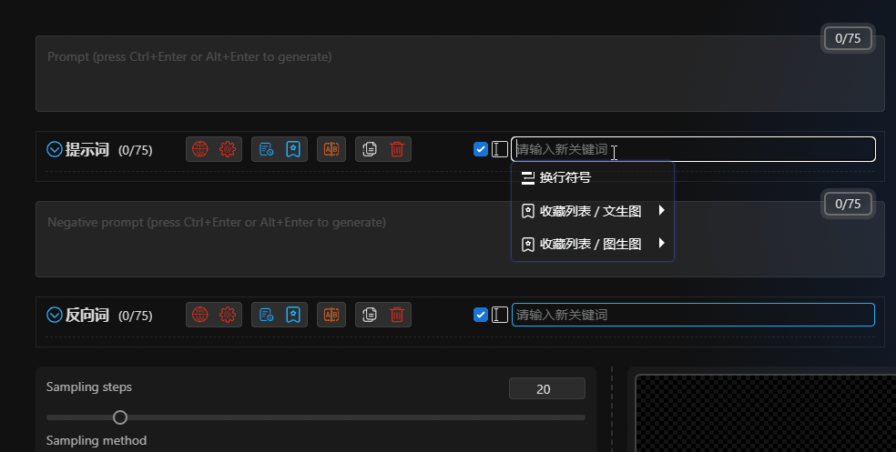

# 关键词输入框

1. 你可以输入你的本地语言，如果你启用了自动翻译，你的输入将会被自动翻译到英文。如果你没有启用自动翻译，你也可以在输入完成后手动点击翻译按钮。

2. 你可以输入非英文标点符号，例如 `，` `。` `（）` `【】` 等等，它们都将被自动转为英文标点符号。免去了你手动切换输入法的麻烦。

3. 支持 [a1111-sd-webui-tagcomplete](https://github.com/DominikDoom/a1111-sd-webui-tagcomplete) 扩展的功能（需要你已安装该扩展）。

   

4. 在输入框没有任何内容的情况下，点击输入框会展示一个下拉菜单。你可以用鼠标选择菜单中的内容，你也可以使用键盘的上下左右和回车选择不同的内容。如果你不想使用下单菜单，你可以前往 [主题风格](/zh-CN/ThemeStyle.md#主题风格) 中关闭它。

5. 你可以在下拉菜单中选择 `换行符号`。它将在WebUI的输入框中插入一个换行符号。如果你需要 `换行符号` 在扩展面板中实际也换行显示。你可以前往 [主题风格](/zh-CN/ThemeStyle.md#主题风格) 中开启此功能。

6. 你可以在下拉菜单中选择 `收藏` 的Prompts，并将它们插入到当前的Prompts后面。（在收藏夹中的 `使用` 按钮，是清空当前的Prompts，而这里则是插入）