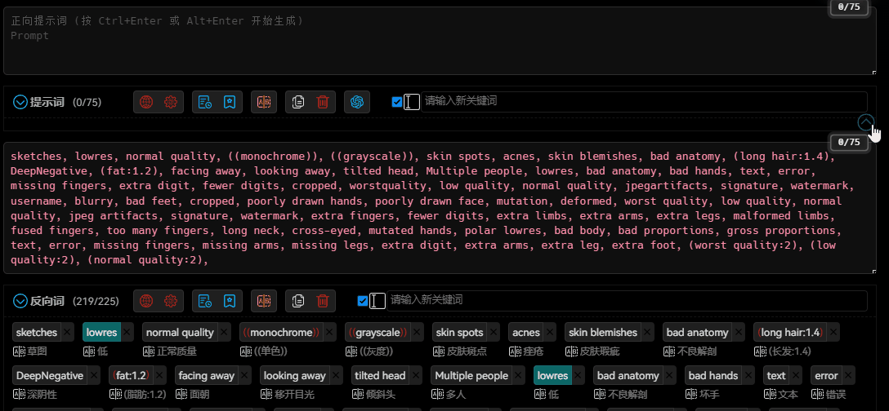

# 關鍵詞分組 / 一鍵添加關鍵詞



> 提示詞整合來源 路过银河(知乎)、未知作者(Google Drive)、互聯網等等，感謝這些作者的無私奉獻！

## 功能說明

1. 點擊不同的分類名和關鍵詞，可將關鍵詞加入輸入框中。
2. 可以自定義不同分組的關鍵詞顏色，也可以去掉顏色。
3. 可以自定義關鍵詞組內容。

## 關鍵詞文件

### 文件種類

1. 關鍵詞是以 YAML 格式的檔案，放在 `group_tags` 目錄下。
2. 不建議直接修改 `default.yaml` 和 `國家語言代碼.yaml` 檔案。如果需要自訂關鍵詞組，請使用 `custom.yaml`、`prepend.yaml` 和 `append.yaml` 檔案。

- `default.yaml`：預設檔案，不可刪除。該檔案沒有本地化翻譯，主要顯示在英文界面。
- `國家語言代碼.yaml`：不同語言環境的關鍵詞檔案（不建議修改）。
- `custom.yaml`：自訂檔案，由使用者建立。如果存在此檔案，將不顯示 `國家語言代碼.yaml` 檔案的內容。
- `prepend.yaml`：自訂檔案，由使用者建立。如果存在此檔案，將會將該檔案的內容添加到 `國家語言代碼.yaml` 檔案的內容之前。
- `append.yaml`：自訂檔案，由使用者建立。如果存在此檔案，將會將該檔案的內容添加到 `國家語言代碼.yaml` 檔案的內容之後。

### 檔案載入順序

1. 插件將優先載入 `custom.yaml` 檔案，如果該檔案不存在，則載入 `國家語言代碼.yaml` 檔案。如果該檔案也不存在，最後載入 `default.yaml` 檔案。
2. 如果同時存在 `prepend.yaml` 檔案，將會將 `prepend.yaml` 檔案的內容添加到已載入的檔案內容之前。
3. 如果同時存在 `append.yaml` 檔案，將會將 `append.yaml` 檔案的內容添加到已載入的檔案內容之後。

### 關於翻譯
1. 目前只翻譯了部分國家語言的關鍵詞，如果沒有你所使用的語言，可以將 `default.yaml` 複製為 `custom.yaml`，然後自行翻譯。
2. 只有少部分國家語言的關鍵詞已經翻譯，如果沒有你所使用的語言，可以自行翻譯，也可以到 GitHub 提交 Issue 申請翻譯。
3. 目前的關鍵詞翻譯均為機翻，可能會有一些錯誤，如果你發現了錯誤，可以到 GitHub 提交 Issue 申請修改。

### 內容格式

```yaml
- name: 一級分類名
  groups: 二級分類列表
    - name: 二級分類名
      color: 關鍵詞文本預設顏色（可以為空），CSS顏色代碼，例如：#ff0000, red, rgb(255,0,0), rgba(255,0,0,1), hsl(0,100%,50%), hsla(0,100%,50%,1)
      tags: 關鍵詞列表
        - 英文關鍵詞: 本地化翻譯
        - 英文關鍵詞: 本地化翻譯
        ...
```

1. 如果存在特殊符號，建議使用雙引號包裹關鍵詞。
2. `:` 後面必須有一個空格。
3. 每一個層級前面的空格數必須一致。
4. 每一個子分類下的 `英文關鍵詞` 必須唯一，不能重複。
5. `本地化翻譯` 可以為空，如果為空，則顯示 `英文關鍵詞`。
6. 建議使用專業的文本編輯器（如 Visual Studio Code）編輯此檔案，以避免編碼和格式錯誤的問題。
7. 請勿使用 Windows 自帶的記事本編輯此檔案。
8. 修改後可以前往 [https://www.yamllint.com/](https://www.yamllint.com/) 檢查內容格式是否正確。