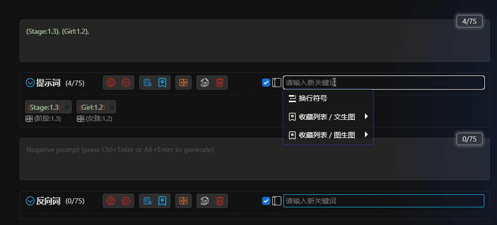

# 關鍵詞輸入框

1. 你可以輸入你的本地語言，如果你啟用了自動翻譯，你的輸入將會被自動翻譯到英文。如果你沒有啟用自動翻譯，你也可以在輸入完成後手動點擊翻譯按鈕。

2. 你可以輸入非英文標點符號，例如 `，` `。` `（）` `【】` 等等，它們都將被自動轉為英文標點符號。免去了你手動切換輸入法的麻煩。

3. 支持 [a1111-sd-webui-tagcomplete](https://github.com/DominikDoom/a1111-sd-webui-tagcomplete) 擴展的功能（需要你已安裝該擴展）。

   

4. 在輸入框沒有任何內容的情況下，點擊輸入框會展示一個下拉菜單。你可以用滑鼠選擇菜單中的內容，你也可以使用鍵盤的上下左右和回車選擇不同的內容。如果你不想使用下單菜單，你可以前往 [主題風格](/zh-TW/ThemeStyle.md#主題風格) 中關閉它。

5. 你可以在下拉菜單中選擇 `換行符號`。它將在WebUI的輸入框中插入一個換行符號。如果你需要 `換行符號` 在擴展面板中實際也換行顯示。你可以前往 [主題風格](/zh-TW/ThemeStyle.md#主題風格) 中開啟此功能。

6. 你可以在下拉菜單中選擇 `收藏` 的Prompts，並將它們插入到當前的Prompts後面。（在收藏夾中的 `使用` 按鈕，是清空當前的Prompts，而這裡則是插入）